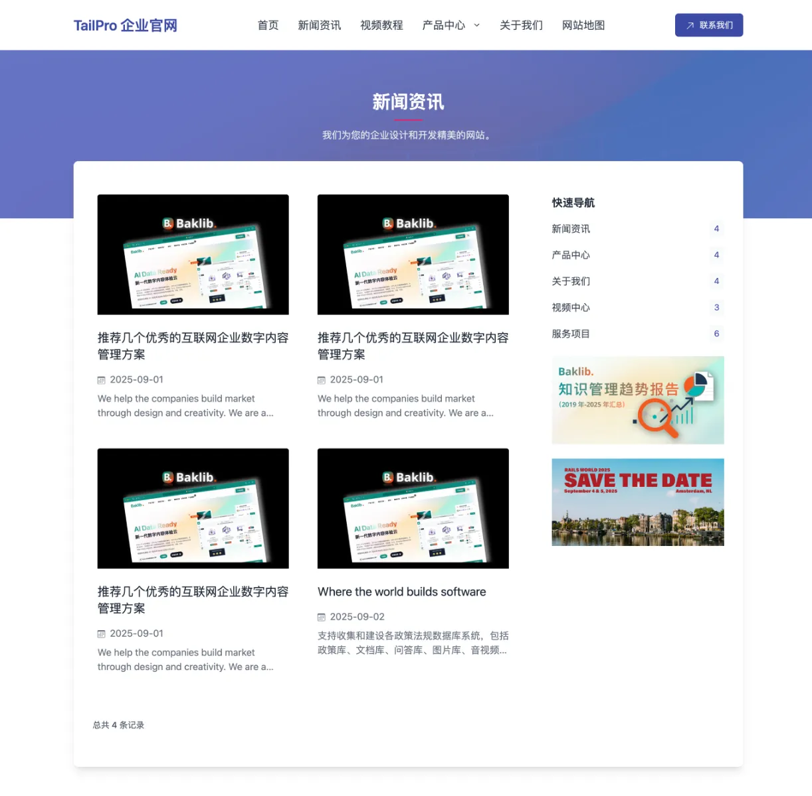

# Tailpro Baklib CMS Template

Multipurpose Tailwind Template to build website for Advertising, Branding, Creative, Digital, Graphic, Marketing, Mobile App, SEO, Social Media, Web Design

一款多用途企业官网建设模板，适用于搭建广告、品牌推广、创意、数字业务、平面设计、市场营销、移动应用、搜索引擎优化（SEO）、社交媒体、网页设计等领域的网站。
由 Baklib CMS 部署的 HTML 落地页模板。

HTML landing page template deployed by Baklib CMS.





## 🚀 Project Structure

```
  .
├── config
│   └── settings_schema.json
├── layout
│   └── theme.liquid
├── package-lock.json
├── package.json
├── README.md
├── snippets
│   ├── _breadcrumb.liquid
│   ├── _feedback_btn.liquid
│   ├── _feedback_form copy.liquid
│   ├── _feedback_form.liquid
│   ├── _footer.liquid
│   ├── _header_s.liquid
│   ├── _header.liquid
│   ├── _play_youtube_video.liquid
│   ├── demo
│   │   ├── _about.liquid
│   │   ├── _brands.liquid
│   │   ├── _services.liquid
│   │   └── _services2.liquid
│   └── hero
│       └── _hero_title.liquid
├── statics
│   ├── the statics folder store the default demo pages
├── tailwind.config.js
├── templates
│   ├── channel.liquid
│   ├── channel.list.liquid
│   ├── channel.side.liquid
│   ├── channel.videos.liquid
│   ├── index.liquid
│   ├── index.marketing.liquid
│   ├── index.web-design.liquid
│   ├── page.liquid
│   ├── page.side.liquid
│   ├── page.video.liquid
│   ├── search.liquid
│   └── tag.liquid
├── yarn-error.log
└── yarn.lock
```


## 🧞 Install guide


- The Template install Guide: https://help.baklib.cn/themes/tailpro

- The Baklib template install Guide: https://dev.baklib.cn/guide/git